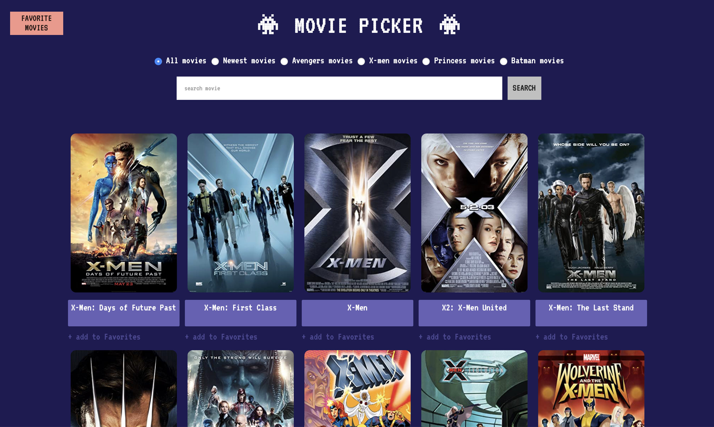

# MoviePicker App

Winc Academy's 2nd project of the Front-end Development traineeship

## 💬 Project Goal

The goal was making a movie searcher using JavaScript and a database with movies (see database.js). 📽️
With this app your can filter several types of movies, and by clicking on the movies you get linked to its IMDB page.

## 💬 Tools

HTML, CSS, JavaScript

## 💬 Requirements

* as user you ca see a list of available movies + poster (--> button all movies)
* the app contains min 5 filters (radiobuttons) which filter specific types of movies
    - newest movies
    - Avengers movies
    - X-men movies
    - Princess movies
    - Batman movies
* clicking on a poster will send you to the movies' IMDB page
* entering a title (OR part of title) in the search bar...will find and display matched movies
* search bar is capital insensitive
* app is responsive to screen size
* make a favorite movies page
* add movies to favorites list 

## 🚀 Preview

Pick your fav movie:
https://moviepicker-js.netlify.app

ENJOY!

